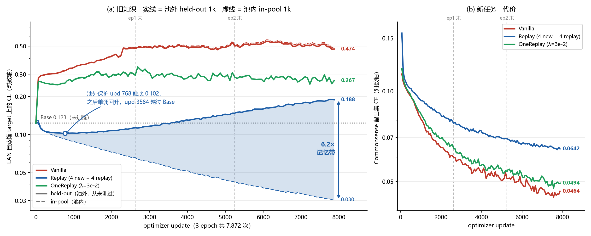

# 实验结果汇总：性能与开销

数据来源：`2026-08-09_LoRA_replay_sdcov_lambda.md`、`2026-08-03_opd_replay_performance汇总.md`、`当前结果总结.md`，以及 `onereplay/slurm/outputs/` 下的原始日志。第四章另有 Hopper（PBS）作业 579879 的日志与 `onereplay/scripts/compare_cov_scale.py` 的输出。

开销表只包含性能表中出现的那几个 run，不引入其他实验。

## 时间口径：稳态 ms/step

所有时间取**稳态**，定义为该 run 全部 500 步窗口速度（日志 `win=` 字段）的**第 25 百分位**。节点争抢只会让窗口变慢不会变快，取低分位可剔除这部分污染；累计平均和中位数都会把污染算进来。取 25 而非 10 分位，是因为窗口数在各 run 间差别很大（饱和测试每个 run 只有 8 个窗口，第 10 百分位会退化成最小值；正式训练 run 有 129~255 个窗口），25 分位在两种规模下行为一致。

两个旧实现、计算量完全相同的 OneReplay run 可以验证这个口径：稳态下是 97.5 与 98.3 ms（差 0.8%），而取中位数是 105.0 与 100.4 ms（差 4.6%），取累计平均是 117.0 与 100.0 ms（差 17%）。当前 λ=3e-2 已改为每次 optimizer update 只计算一次正则，开销结果见 1.2 节。

单 epoch 与合计时长一律由「稳态 ms/step × 步数」推算，不用实测墙钟。

第二章的 OPD 两个 run 不适用该口径（一个只有 4 个窗口、另一个早于 `win=` 字段），改用步 1501–2000 的区间值，两者口径一致，说明见 2.2 节。第三章是带探针的重跑，时间里含测量开销，不参与任何开销对比。

---

# 第一章　Base / Vanilla / Replay / OneReplay

## 1.0 配置

Qwen3-1.7B + LoRA（r=8, α=16, dropout 0.1, `q_proj,v_proj`，56 层，可训练参数 1,605,632 / 1,722,180,608 = **0.093%**），Commonsense170k（168,715 训练 / 1,000 验证），3 epoch，lr 1e-4，micro-batch 8，max_len 512，bf16，seed=1，单卡 H100 80GB。

旧知识语料统一为 FLAN 20k 的**自蒸馏**版本（19,994 条中丢弃 2,565 条截断行，剩 17,429 条可用）。OneReplay（自蒸馏 C）的 C 与 Replay 的语料同源；OneReplay（原版）的 C 采自 FLAN gold target。

| 行 | run 名 | 作业 | 说明 |
|---|---|---|---|
| Base | — | — | 未训练 |
| Vanilla | `cs_vanilla_seed1` | 2170645 | |
| Replay（自蒸馏，50%） | `cs_replaymix_4n4r_seed1` | 2849732_2 | 每个 micro-batch = 4 new + 4 replay，accum 128 |
| EWC | `cs_ewc_lam3e2_seed1` | 2981290_0 | λ=3e2，对角 Fisher |
| OneReplay | `cs_onereplay_lam3e-2_seed1` | 2856542_1 | λ=3e-2 |
| OneReplay（自蒸馏 C） | `cs_onereplay_sdcov_lam1e-2_seed1` | 2856510_0 | λ=1e-2 |

Replay 50% 档的构成：replay 占**行**的 50.00%，占 **supervised token 的 93.16%**（Commonsense target 平均 7.0 个 supervised token，自蒸馏 replay target 平均 94.8 个）；每 epoch 消耗 168,712 条 replay，池子 17,429 条循环 9.68 次。

OneReplay（自蒸馏 C）与 gold C 的 `trace` 逐层比值：均值 0.976，min 0.932，max 1.004，等效 λ = 1.02e-2。

EWC 用的是 assistant-only、序列求和的对角经验 Fisher（作业 2944210），采自与 OneReplay 的 C **同一个** FLAN 20k 池（指纹 `9dd3398a…` 一致），56 层 `q_proj`/`v_proj`，惩罚项每次 optimizer update 只算一次。F 的 mean magnitude 是 9.98e-2，所以 EWC 的 λ 量级与 OneReplay 完全不可比，λ 网格是独立扫的。

## 1.1 性能

### IFEval（541 条，%）

| 方法 | strict prompt | strict inst | loose prompt | loose inst |
|---|---:|---:|---:|---:|
| Base | 66.54 | 74.70 | 70.61 | 77.94 |
| Vanilla | 55.08 | 65.23 | 57.49 | 67.39 |
| Replay（自蒸馏，50%） | 65.43 | 73.74 | 69.69 | 77.10 |
| EWC（λ=3e2） | 65.99 | 73.62 | 70.06 | 77.10 |
| OneReplay（λ=3e-2） | 66.17 | 73.38 | 68.58 | 75.54 |
| OneReplay（自蒸馏 C，λ=1e-2） | 65.62 | 73.02 | 68.76 | 75.78 |

### Multi-IF English（909 组 × 3 轮，strict，%）

| 方法 | 平均 prompt | 平均 inst | turn 1 | turn 2 | turn 3 |
|---|---:|---:|---:|---:|---:|
| Base | 49.47 | 73.34 | 68.32 | 48.84 | 31.25 |
| Vanilla | 31.47 | 60.65 | 57.43 | 27.17 | 9.82 |
| Replay（自蒸馏，50%） | 48.66 | 73.17 | 67.66 | 48.18 | 30.13 |
| EWC（λ=3e2） | 48.66 | 72.43 | 67.33 | 48.18 | 30.47 |
| OneReplay（λ=3e-2） | 47.06 | 72.01 | 68.76 | 46.42 | 26.00 |
| OneReplay（自蒸馏 C，λ=1e-2） | 48.18 | 72.03 | 68.54 | 46.31 | 29.69 |

turn 列为 strict prompt accuracy。

### 新任务：Commonsense 留出集 val loss

| 方法 | ep1 | ep2 | ep3 |
|---|---:|---:|---:|
| Base | 12.815 | — | — |
| Vanilla | 0.06039 | 0.05133 | 0.04494 |
| Replay（自蒸馏，50%） | 0.07927 | 0.06967 | 0.06463 |
| EWC（λ=3e2） | 0.09434 | 0.08843 | 0.08489 |
| OneReplay（λ=3e-2） | 0.06278 | 0.05375 | 0.04916 |
| OneReplay（自蒸馏 C，λ=1e-2） | 0.06174 | 0.05263 | 0.04718 |

### EWC 的 λ 选择

四个 λ 全跑完（作业 2981290，array 0–3），上面各表只收 λ=3e2 一行。

| λ | run | IFEval strict prompt | IFEval loose prompt | Multi-IF 平均 prompt | val loss ep3 |
|---|---|---:|---:|---:|---:|
| 1e2 | `cs_ewc_lam1e2_seed1` | 65.80 | 69.87 | 47.52 | 0.07648 |
| **3e2** | `cs_ewc_lam3e2_seed1` | **65.99** | **70.06** | **48.66** | 0.08489 |
| 1e3 | `cs_ewc_lam1e3_seed1` | 65.62 | 68.76 | 47.66 | 0.09748 |
| 1e4 | `cs_ewc_lam1e4_seed1` | 65.80 | 69.69 | 48.18 | 0.11819 |

λ=3e2 在三个旧知识指标上全都是最好的，新任务 val loss 排第二（只输给保护最弱的 1e2），所以取它。旧知识那一侧在整个两个数量级的区间里几乎不动（strict prompt 65.62~65.99，跨度 0.37 个点，小于 541 条样本的噪声），真正随 λ 单调变化的只有新任务 val loss（0.0765 → 0.1182）；也就是说这个网格上 EWC 的旋钮只在往下压新任务，没有换来可分辨的旧知识收益。

## 1.2 开销

### 训练（3 epoch，单卡 H100 80GB）

| 方法 | 步数/epoch | accum | 稳态 ms/step | vs Vanilla | 单 epoch | 3 epoch 合计 | peak allocated | peak reserved | 其中 C 常驻 |
|---|---:|---:|---:|---:|---:|---:|---:|---:|---:|
| Vanilla | 21,090 | 64 | 87.5 | 基准 | 1,845 s | 1.54 h | 21.29 GiB | 23.00 GiB | 0 |
| Replay（自蒸馏，50%） | 42,178 | 128 | 109.2 | +24.8% | 4,606 s | 3.84 h | 21.29 GiB | 23.00 GiB | 0 |
| EWC（λ=3e2） | 21,090 | 64 | 89.4 | +2.2% | 1,885 s | 1.57 h | 21.94 GiB | 23.82 GiB | 0.656 GiB（F） |
| OneReplay（λ=3e-2，当前实现） | 21,090 | 64 | 88.9 | **+1.6%** | 1,875 s | 1.56 h | 22.16 GiB | 24.03 GiB | 0.875 GiB |
| OneReplay（自蒸馏 C，λ=1e-2，旧实现） | 21,090 | 64 | 98.3 | +12.3% | 2,073 s | 1.73 h | 22.17 GiB | 24.03 GiB | 0.875 GiB |

EWC 行的「其中 C 常驻」放的是对角 Fisher `F`，不是协方差 `C`：对角 F 每层只存一个与权重同形的张量，比 OneReplay 的 `C` 省 0.219 GiB。

**当前 OneReplay λ=3e-2 的时间开销已从旧实现的 +10.7% 降至 +1.6%。** 新实现（作业 2981291，`cs_onereplay_lam3e-2_seed1_regonce`）把正则从每个 micro-batch 重复计算改为每个 optimizer update 只算一次。同一作业、同一节点的配对 Vanilla 是 87.5 ms/step，OneReplay 是 88.9 ms/step；单次正则求值约 11.0 ms/update，accumulation 为 8 个 micro-batch，摊销后是 1.38 ms/step，与实测 +1.4 ms 完全一致。训练轨迹与旧实现近乎重合，外部评测差异均小于 1 个百分点，因此没有观察到明显的效果损失。该优化只减少计算频率，不降低单次求值的峰值显存，仍比 Vanilla 多约 0.87 GiB allocated。

**EWC 的 +2.2% 也已经接近测量噪声。** 四个 λ 的稳态分别是 87.6（1e2）/ 89.4（3e2）/ 88.5（1e3）/ 91.8（1e4）ms，彼此的跨度比它们与 Vanilla 的差距还大，其中 1e2 那条甚至比当前 Vanilla 快。原因是惩罚项每次 optimizer update 才算一次（`reg_once_per_update=1`，accum 64），且对角 F 下这项只是逐元素乘加，摊到 micro-step 上几乎为零。

Replay 那一行的单步比 Vanilla 贵，是因为 replay 序列长得多（supervised token 平均 94.8 vs 7.0），动态 padding 下每步 token 数被拉高；其总时长翻倍则另有步数从 21,090 涨到 42,178 的因素。

**Vanilla 行的时间与显存不来自 `cs_vanilla_seed1` 本身。** 该 run（2170645）早于成本日志功能，日志里没有 `train_sec` / `sec_per_step` 字段，只有含评测的 `elapsed_sec`（3342 / 2811 / 3007 s）；而且它设了 `measure_replay_when_lambda_zero=1`，`train_replay_reg` 是 63.3 / 161.6 / 348.7 的非零值，说明它每步都加载 C 并计算了正则，不是干净的 vanilla 计时。按其 `elapsed_sec` 反推单步是 158 / 133 / 143 ms，比同配置的干净 vanilla 慢 1.5~1.8 倍，正则只能解释其中 9~11 ms，其余来自 7 月版本的代码与环境，无法追溯。**若直接采用该 run 的墙钟，会得到「vanilla 2.54 h 比 OneReplay 1.79 h 还慢」这种不成立的结果。**

表中 Vanilla 时间与显存来自当前开销作业 2981291 的同节点配对测量（`lora_van_rep1`，5,000 步）。该值也得到三组历史测量印证：饱和测试两次重复的 25 分位 88.1 / 88.9 ms、最快一次重复的全程平均 89.2 ms，以及 `bench_vanilla` 全量 21,090 步的稳态区间 88.0 ms，全部相差在 2% 以内。其余各行的时间与显存均出自对应方法自身的日志。

### 一次性开销（可在多次训练间摊销）

| 方法 | 内容 | 耗时 | 存储 |
|---|---|---:|---:|
| Vanilla | 无 | — | — |
| Replay（自蒸馏，50%） | 自蒸馏语料生成（20k prompt） | 39 min | 数十 MB jsonl |
| EWC（λ=3e2） | 采集对角 Fisher（qv，56 层，作业 2944210） | 18 min | 0.656 GiB |
| OneReplay（λ=3e-2） | 采集 gold C（qv，56 层，作业 2133184） | 30 min | 0.875 GiB |
| OneReplay（自蒸馏 C，λ=1e-2） | 自蒸馏语料生成 + 采集 C（作业 2849738） | 39 + 15.5 = 54.5 min | 0.875 GiB |

自蒸馏生成明细：池子 19,994 条，1,488 条因 prompt 超过 488 token 被跳过，2,565 条因答案撞上生成预算被标 truncated 并丢弃，最终 17,429 条可用，平均答案长度 90 token。

Fisher 采集明细：20,000 条，55 ms/条，18.2 min（作业整体墙钟 21 min）。诊断值提示这个 F 本身很稀：有效样本量只有 2,547 / 20,000（ratio 0.127），1,408 行（7.04%）因右截断吃掉回答而没有任何受监督 token，平均受监督 token 数 24.1、中位数只有 8。

### 评测

IFEval（541 条）+ Multi-IF English（909 组 × 3 轮）每个模型约 3 h，各方法相同。

---

# 第二章　OPD 内部对比：vanilla vs 协方差正则

## 2.0 配置

Qwen3-1.7B + LoRA（r=8, α=16, dropout 0.1, `q_proj,v_proj`，可训练参数 1,605,632 / 1,722,180,608 = **0.093%**），student 在 cuda:0、冻结的 Qwen3-8B teacher 在 cuda:1，双卡 H100 80GB。Commonsense170k，1 epoch 上限 **2,000 步**（batch 4 × 2,000 = 8,000 样本，约一个 epoch 的 4.7%），accum 32，lr 1e-5，max_len 512，`OPD_TEMPERATURE=1.0`、`OPD_KL_TEMPERATURE=1.0`、`OPD_MAX_NEW_TOKENS=128`，seed=1。

| 行 | run 名 | 作业 | 正则口径 |
|---|---|---|---|
| Base | — | — | 未训练 |
| OPD vanilla | `cs_opd_truevanilla_seed1` | 2832597 | 不加载 C，不计算正则（`MEASURE_REPLAY_WHEN_LAMBDA_ZERO=0`） |
| OPD（λ=1e-4） | `cs_opd_lam1e-4_seed1` | 2649408 | 加载 C，计算正则并计入 loss |

两个 run 除该开关外逐项同配置，正则是本章唯一的变量。

**OPD vanilla 的性能直接复用 `cs_opd_lam0_seed1` 的评测结果。** 依据是两次训练轨迹逐位相同：`train_task_loss` 都是 1.226359612776665，`val_loss` 都是 0.9462042945623398，四个打印步的 task_loss 也逐位一致（0.325594 / 2.077461 / 0.313816 / 0.718801）。λ=0 那条虽然加载了 C 并每步求值，但 `train_lambda_reg=0.0`，该项不进 loss、梯度为 0，产出的 LoRA 权重与真 vanilla 是同一份；2832597 本身设了 `SAVE=0`，没有保存 adapter。开销则一律用 2832597，因为 λ=0 那条付了全额正则计算开销，不能当 vanilla 基线。

## 2.1 性能

### IFEval（541 条，%）

| 方法 | strict prompt | strict inst | loose prompt | loose inst |
|---|---:|---:|---:|---:|
| Base | 66.54 | 74.70 | 70.61 | 77.94 |
| OPD vanilla | 65.25 | 73.38 | 69.13 | 76.74 |
| OPD（λ=1e-4） | 66.54 | 74.46 | 70.61 | 77.70 |

### Multi-IF English（909 组 × 3 轮，strict，%）

| 方法 | 平均 prompt | 平均 inst | turn 1 | turn 2 | turn 3 |
|---|---:|---:|---:|---:|---:|
| Base | 49.47 | 73.34 | 68.32 | 48.84 | 31.25 |
| OPD vanilla | 48.11 | 72.32 | 66.89 | 47.08 | 30.36 |
| OPD（λ=1e-4） | 48.51 | 72.67 | 67.77 | 47.74 | 30.02 |

turn 列为 strict prompt accuracy。

### 新任务

| 方法 | 训练末期 val loss（蒸馏目标） | 独立 Commonsense 评测 CE（gold 标签） |
|---|---:|---:|
| Base | — | 12.815 |
| OPD vanilla | 0.9462 | 10.620 |
| OPD（λ=1e-4） | 0.9581 | 10.637 |

两列口径不同：训练期 val loss 是对 teacher 输出的蒸馏损失，独立评测是在 Commonsense gold 标签上的交叉熵。两者都不能与第一章的 SFT val loss 并排读。

## 2.2 开销

### 训练（2,000 步，双卡 H100 80GB）

| 方法 | 稳态 ms/step | 稳态推算总时长 | 实测墙钟 | 稳态 tokens/s | peak allocated | peak reserved | 其中 C 常驻 |
|---|---:|---:|---:|---:|---:|---:|---:|
| OPD vanilla | 198.3 | 396.6 s | 618.9 s | 2,298 | 27.56 GiB | 28.85 GiB | 0 |
| OPD（λ=1e-4） | 209.1 | 418.2 s | 620.6 s | 2,179 | 28.44 GiB | 29.73 GiB | 0.875 GiB |
| **正则增量** | **+10.8 ms（+5.4%）** | +21.6 s | — | −5.2% | **+0.88 GiB** | +0.88 GiB | — |

两个 run 的 `train_tokens` 都是 911,302，稳态 tokens/s 由此除以稳态推算时长得到。

实测墙钟里冷启动占比很大，不适合做对比：OPD vanilla 的步 1–500 区间是 561.8 ms/step，是稳态 198.3 ms 的 2.8 倍；把冷启动算进去的全程 tokens/s 只有 1,472（vanilla）与 1,469（λ=1e-4），两者几乎相等，会掩盖掉真实的 5.4% 差距。

稳态取值：OPD vanilla 的 198.3 ms 来自日志 `win=` 字段的步 1501–2000 区间；λ=1e-4 早于该字段，由累计平均反推（`0.310278×2000 − 0.344×1500`，再除以 500）得 209.1 ms。

### 显存分卡明细

| 方法 | cuda:0（student） | cuda:1（teacher） | 合计 allocated | 合计 reserved |
|---|---:|---:|---:|---:|
| OPD vanilla | 11.24 GiB | 16.33 GiB | 27.56 GiB | 28.85 GiB |
| OPD（λ=1e-4） | 12.12 GiB | 16.33 GiB | 28.44 GiB | 29.73 GiB |

正则的 0.88 GiB 增量全部落在 student 卡；teacher 卡逐位相同（16.32853937149048 GiB）。

### 一次性开销

| 方法 | 内容 | 耗时 | 存储 |
|---|---|---:|---:|
| OPD vanilla | 无 | — | — |
| OPD（λ=1e-4） | 采集 gold C（qv，56 层，作业 2133184） | 30 min | 0.875 GiB |

两者都需要常驻第二张卡放 Qwen3-8B teacher（16.33 GiB，全程冻结只做推理）。

---

# 第三章　held-out 探针：Replay 的保护有多少是记忆

第一、二章里「旧知识」全部由 IFEval / Multi-IF 这类外部基准衡量，看不出 Replay 在 FLAN 上的收益到底是能力保持还是把那 17,429 行背了下来。本章用一个池外探针把两者分开。

## 3.0 配置

三个 run 与第一章同配置重跑一遍（`SAVE=0`，只为拿探针曲线），每 **64 次 optimizer update** 评一次，3 epoch 共 7,872 次更新、124 个探针点。

| 行 | run 名 | 作业 | accum | 说明 |
|---|---|---|---:|---|
| Vanilla | `cs_vanilla_seed1_probe` | 2981453_1 | 64 | |
| Replay（自蒸馏，50%） | `cs_replaymix_4n4r_seed1_probe` | 2981453_0 | 128 | 4 new + 4 replay |
| OneReplay（λ=3e-2） | `cs_onereplay_lam3e-2_seed1_probe` | 2981453_2 | 64 | |

每个探针点同时测三个量，都是 1,000 行：

| 探针 | 语料 | 含义 |
|---|---|---|
| `flan_heldout` | FLAN 分片 [20000, 21500) 的自蒸馏 target | **池外**旧知识，训练中从未出现 |
| `flan_inpool` | replay 训练池本身 | 池内旧知识 |
| `cs_val` | Commonsense 留出集 | 新任务 |

**held-out 语料的构造与自检。** 取 FLAN 全量 1,386,050 行 shuffle 后的 [20000, 21500) 切片（训练池是 [0, 20000)），用 base Qwen3-1.7B 自蒸馏出 target，1,500 行里 117 行 prompt 超 488 token 被跳过，平均答案 87 token。第一次尝试（作业 2948829，三个 task 全部中止）发现 `--pool_offset` 没有真正隔开：1,500 行里有 **98 行（6.5%）的 prompt 文本仍落在训练池的 18,725 个 prompt 里**，日志判定该语料不可用。2981453 改成显式按 prompt 文本做差集，剔掉这 98 行、再剔掉截断/空 target 的 202 行，剩 1,200 行，自检确认与训练池零 prompt 重叠，探针从中取 1,000 行。

**口径注意：这个 loss 是对 base 模型自蒸馏 target 的交叉熵**，衡量「模型偏离自己原始行为多远」，不是对 gold 标签的准确率。base 自己的 0.1231 是构造出来的下界而不是满分，也因此本章的数值不能与第一章的 SFT val loss 并排读。两个探针集难度相当（base 上 0.1231 vs 0.1302）。

**探针基本没有干扰训练轨迹。** Replay 那条的 epoch 3 val_loss 与第一章的历史 run 逐位一致（0.064629361）；Vanilla 与 OneReplay 分别相差 2.3e-3 与 7.5e-4，量级远小于各方法之间的差距。

## 3.1 结果

图的读法：同一颜色的实线（池外）与虚线（池内）**是否分叉**就是结论。Vanilla 与 OneReplay 的两条线全程贴合，Replay 的两条线从一开始就往相反方向走，中间那片蓝色就是记忆量。纵轴取对数，所以带宽的垂直高度直接对应倍数。作图脚本见 `figs/plot_probe.py`。

### 训练结束时（epoch 3，第 7,872 次更新）

| 方法 | held-out FLAN | in-pool FLAN | held/pool | CS val |
|---|---:|---:|---:|---:|
| Base | 0.1231 | 0.1302 | 0.95 | 12.82 |
| Vanilla | 0.4742 | 0.4892 | 0.97 | 0.0464 |
| Replay（自蒸馏，50%） | 0.1884 | 0.0304 | **6.19** | 0.0642 |
| OneReplay（λ=3e-2） | 0.2669 | 0.2643 | 1.01 | 0.0494 |

**只有 Replay 出现了池内池外的劈叉。** Vanilla 与 OneReplay 的 held/pool 比值是 0.97 与 1.01，两者都没在 FLAN 文本上做过梯度更新，池内池外一视同仁；Replay 是 6.19。它把 in-pool 压到 0.0304，比生成这些 target 的 base 模型自己（0.1302）还低 4.3 倍——这只能是对那 17,429 行的记忆，不是能力保持。

### 换算成「相对 Vanilla 消除了多少遗忘」

以超出 base 的部分为遗忘量，`1 − (方法 − base) / (Vanilla − base)`：

| 方法 | 用 in-pool 衡量 | 用 held-out 衡量 |
|---|---:|---:|
| Replay（自蒸馏，50%） | 127.8% | **81.4%** |
| OneReplay（λ=3e-2） | 62.6% | **59.0%** |

Replay 从「比 base 还好」缩水到 81.4%，OneReplay 几乎不动。**这 46 个百分点的差额就是记忆的部分**；换口径后 Replay 对 OneReplay 的领先从 65 个百分点收窄到 22 个。

### 逐 epoch 轨迹

| 方法 | 探针 | ep1 末 | ep2 末 | ep3 末 |
|---|---|---:|---:|---:|
| Vanilla | held-out | 0.4795 | 0.5013 | 0.4742 |
| Replay | held-out | 0.1131 | 0.1476 | 0.1884 |
| Replay | in-pool | 0.0656 | 0.0421 | 0.0304 |
| OneReplay | held-out | 0.2953 | 0.2848 | 0.2669 |

**Replay 的 held-out 曲线是 U 形的，OneReplay 是单调改善的。** Replay 在第 768 次更新（epoch 0.29）触底 0.1022，之后一路回升，在第 3,584 次更新（epoch 1.37）越过 base 线，最终停在 0.1884（比 base 差 53%）；同期 in-pool 单调下降到 0.0304。训练越久，它对池子拟合越深，对池外旧知识的保护反而越差。OneReplay 方向相反，三个 epoch 末 0.2953 → 0.2848 → 0.2669。Vanilla 第 64 次更新就从 0.1231 掉到 0.2815，此后在 0.47~0.55 之间震荡。

三者相对 base 的最终退化是 Replay +53.0%、OneReplay +116.8%、Vanilla +285.1%。按 held-out 这个更诚实的口径，名次没变（Replay 优于 OneReplay 优于 Vanilla），但领先幅度远不及 in-pool 数字（0.0304 对 0.2643，差 8.7 倍）看上去那么大。

## 3.2 开销

探针本身每次约 15.7 s（3,000 行前向），124 次合计约 32 min，摊到 3 epoch 上使 Replay 那条的稳态从 109.2 涨到 118.3 ms/step。这是测量开销，不属于方法开销，不进第一章的表。

---

# 第四章　C 的来源：任务平衡采样为什么没有效果

前三章里 C 一律采自「FLAN 全量 shuffle 后取前 20k 行」，也就是本地 dump 的原始行分布。本章换一种采法重采一份 C，训练评测后发现指标不升反降，再往回追为什么。结论是这个干预根本没有落到 C 上，以及由此顺带量出的一件更有用的事：C 到底对语料有多敏感。

本章不涉及训练开销，两份 C 的训练配置与第一章逐字相同，时间和显存也就相同。

## 4.0 配置

FLAN 自己的训练流程并不在原始行分布上训。Wei et al. 把每个数据集截到 30k，再按 T5 的 examples-proportional mixing 以 3k 为 mixing rate maximum 采样，于是行数 ≥ 3k 的任务权重相同，只有更小的被降权；Longpre et al. 后来做过消融，去掉这个混合平衡要掉约 5 点 MMLU 和 11 点 BBH。Muennighoff/flan 这份 dump 是施加该策略**之前**的逐任务数据，所以策略没有被烘焙进文件里。既然 C 要代表「旧知识」，让它照 FLAN 自己的配比来，看上去比照原始行分布更有道理。

`balanced` 就是这个想法的实现：按 `w_i = min(N_i, 3000)` 给 66 个 task 分配行配额（largest-remainder 补齐余数），每个 task 内用 `seed:task` 独立 shuffle 后取前 quota 行，总数仍是 20,000。实现在 `onereplay/data/old_knowledge.py` 的 `allocate_task_quota` / `balanced_task_subset`，由 `collect_cov.py --sample_strategy balanced` 在线调用，不落地成 jsonl。

| 项 | uniform（前三章） | balanced |
|---|---|---|
| 抽样 | `shuffle(seed=1).select(20000)` | 按 task 配额无放回 |
| 行数 | 20,000 | 20,000（66 个 task 全覆盖，weight_sum=179,330） |
| 大任务行份额 | 约 2.16~2.30% | 约 1.67%（对齐 FLAN 目标） |
| pool fingerprint | `9dd3398a…feb2` | `915cacb0…4817c` |
| C 文件 | `cov_flan_chat_20k_qv.pt` | `cov_flan_chat_20k_balanced_qv.pt` |

平衡的单位是 jsonl 的 `task` 字段（已含「数据集 × 10 templates」粒度），**不做序列长度平衡**——FLAN 原文也只平衡任务样本数，长任务在 C 里仍按 token 数占更大权重。

训练 run 是 `cs_onereplay_balanced_lam3e-2_seed1_regonce`（Hopper 作业 579879，由 `01_collect_cov.pbs` 的 `DO_TRAIN_EVAL=1` 一并产出）。除 `--cov_path` 外与第一章的 OneReplay λ=3e-2 逐字同配置。

## 4.1 外部评测：与随机采样不可区分

### IFEval（541 条，%）

| 方法 | strict prompt | strict inst | loose prompt | loose inst |
|---|---:|---:|---:|---:|
| Base | 66.54 | 74.70 | 70.61 | 77.94 |
| OneReplay（λ=3e-2，uniform C） | 66.17 | 73.38 | 68.58 | 75.54 |
| OneReplay（λ=3e-2，balanced C） | 64.88 | 73.14 | 67.10 | 75.30 |

### Multi-IF English（909 组 × 3 轮，strict，%）

| 方法 | 平均 prompt | 平均 inst | turn 1 | turn 2 | turn 3 |
|---|---:|---:|---:|---:|---:|
| Base | 49.47 | 73.34 | 68.32 | 48.84 | 31.25 |
| OneReplay（λ=3e-2，uniform C） | 47.06 | 72.01 | 68.76 | 46.42 | 26.00 |
| OneReplay（λ=3e-2，balanced C） | 46.73 | 72.27 | 66.89 | 47.30 | 26.00 |

### 训练轨迹

| 方法 | ep1 val | ep2 val | ep3 val | ep3 task loss | ep3 reg | ep3 λ·reg |
|---|---:|---:|---:|---:|---:|---:|
| uniform C（regonce，2981291） | — | — | 0.04828 | 0.05135 | 0.10843 | 0.00325 |
| balanced C（579879） | 0.06269 | 0.05321 | 0.04705 | 0.05135 | 0.10957 | 0.00329 |

**差距全部在噪声内。** IFEval strict prompt 差 1.29 个点，541 条上是 7 条 prompt；loose prompt 差 1.48 个点，是 8 条。Multi-IF 平均 prompt 差 0.33 个点（2,714 个 prompt 上约 9 条），而平均 inst 是反向的 +0.26，turn 3 两边都是 0.26004464285714285，896 条里一条不差。同一份 λ 网格上 EWC 的四个点跨度 0.37 个点也被判为小于噪声，这里是同一量级。

**对照口径有个已知缺陷。** 表里 uniform 那行来自 `cs_onereplay_lam3e-2_seed1`（RWTH 作业 2856542_1，旧的每 micro-batch 求值实现），balanced 是 Hopper 上的 regonce 实现。两处差异——集群与 regonce——各自的影响都被记录为「小于 1 个百分点」，与这里看到的 1.29 同量级。要做严格对比需要在 Hopper 上补一条 uniform regonce，`02_sweep_lambda.pbs` 支持 `SAMPLE_STRATEGY=uniform` 直接跑。不过 4.2 的诊断已经让这条补充变得不必要。

## 4.2 诊断：两份 C 几乎是同一个矩阵

外部评测测不动这个量级的差异，但可以绕开评测，直接问输入端：这两份 C 到底差多少。惩罚项是 `(1/L)·Σ_l tr(ΔW_l C_l ΔW_lᵀ)`，C 的采集口径是 `cov_sum / token_count`，没有 trace 归一化，所以换语料就换尺度，同一个 λ 未必是同一个强度——这是最初怀疑「λ 没调好」的理由。工具是 `onereplay/scripts/compare_cov_scale.py`，三个指标互相独立：

| 指标 | 依赖 ΔW | balanced vs uniform | 判读 |
|---|---|---:|---|
| 逐层 trace 比值（均值） | 否 | 0.9999（min 0.9879 max 1.0060） | 尺度相同 |
| 真实 ΔW 下的惩罚比值 | 是 | 1.0052 | 强度相同 |
| top-64 子空间 overlap | 否 | 0.9878 | 方向相同 |
| top-64 alignment | 否 | 0.9993 | 方向相同 |
| 有效秩 / top-1 占比 | 否 | 8.49 vs 8.57 / 34.7% vs 34.6% | 谱形状相同 |

56 层里没有一层的 trace 变化超过 1.2%。**λ=3e-2 在两份 C 上确实是同一个强度**（等效 λ 换算给出 0.03 → 0.03），最初的怀疑不成立；λ 扫描因此没有运行。

真实 ΔW 那一行用的是 balanced run 自己的 A、B，按 `regularizer.py` 里同一个 rank×rank 捷径对两份 C 各求一次 reg，所以它是训练器实际会看到的比值而不是近似。注意这个指标**有偏**：ΔW 是被 C 正则训出来的，训练目标里就有一项在压低 `tr(ΔW C ΔWᵀ)`，分母被人为压小，比值被系统性放大。在 balanced 这一对上无关紧要（两份 C 本来就几乎相同，偏置对称抵消），但在 4.3 里必须当心。

子空间那两行不碰 ΔW，只对 C 本身做特征分解，原理上就没有这个偏置。`alignment_new_to_ref` 是 `tr(P_ref C_new)` 除以 C_new 自己 top-k 能捕获的质量——除掉这个自捕获率是必要的，否则谱一平就永远读不出 1。top-64 抓住了 71.5% / 71.8% 的 trace，k 取得够大。

## 4.3 对照：换成数学语料时 C 会变

上一节只证明了「balanced 这个干预没落到 C 上」，没有回答「C 对语料到底敏不敏感」。拿 31 号那条线已经采好的 `cov_math_metamath30k_qv.pt`（MetaMath，25,114 行，fingerprint `33d447c6…`）当第二个对照，同一套指标：

| 指标 | 随机基线 | balanced vs uniform | MetaMath vs uniform |
|---|---:|---:|---:|
| 逐层 trace 比值（均值） | — | 0.9999 | 0.9100（min 0.8008 max 1.0075） |
| 真实 ΔW 下的惩罚比值 | — | 1.0052 | 1.3518 |
| 与 trace 估计的偏离 | — | 0.5% | 48.5% |
| top-64 子空间 overlap | 0.031 | 0.9878 | **0.4869** |
| top-64 alignment（new→ref） | ~0.04 | 0.9993 | **0.7909** |
| 有效秩 | — | 8.49 | 6.81 |
| top-1 特征值占 trace | — | 34.7% | 39.7% |

随机基线是 `k/d = 64/2048`：两个 64 维子空间在 2048 维里完全随机时的期望 overlap。

**trace 降了 9%，惩罚却升了 35%。** 若两份 C 只差一个缩放，同一个 ΔW 下的惩罚应是 `0.116392 × 0.91 ≈ 0.1059`，实测 0.157341，高出 49%。尺度往下、惩罚往上，只能由方向解释。

但这个 1.3518 是**上界**，不能单独采信：如果 C 正则把 ΔW 在 C_if 主方向上的分量压低了 26%，未受污染的 `reg(C_if)` 就应是 `0.116392 / 0.74 ≈ 0.157`，正好等于 `reg(C_math)`，也就是说这个数可以完全由训练伪影产生。26% 在射程之内——第三章测得 OneReplay 消除了 59~62% 的遗忘，λ·reg 占 task loss 6.4%。**所以定性结论靠的是 overlap 0.4869，不是 1.3518。**

overlap 是随机基线的 15.6 倍，同时只有完全相同的一半；balanced 这个阴性对照给出 0.9878，说明该指标的噪声底在 1.5% 以内，0.4869 因此是真实的跨领域差异。**C 确实编码任务特定信息**，「C 必须来自旧任务数据吗」这个问题的答案是肯定的。

## 4.4 机制：C 是分层的

`alignment` 0.79 远高于 `overlap` 0.49，这个缺口本身是结论。两个量的区别在于加不加能量权重：alignment 按特征值加权，overlap 只数方向。能量加权后高得多，说明**能量集中的那几个方向是跨语料共享的，能量小、数量多的次级方向才是任务特定的**。

这与谱结构吻合：2048 维空间里有效秩只有 8.5，top-1 特征值独占 34.6%。这种极端各向异性的主导方向来自模型自身的表示几何——attention sink、高范数 outlier 维度、LayerNorm 之后的常量偏移那一类——任何文本都激活它们。

两个实验由此串成一条解释：

- FLAN 内部把任务份额从 2.25% 挪到 1.67%，第一层（内容无关）本来就不动，第二层也不动，因为各任务的 token 激活仍落在同一个流形上，重新加权几个百分点撼动不了它。**balanced 的失败是干预粒度选错了，不是 C 对语料不敏感。**
- 换成 MetaMath，第一层依然不动（所以 alignment 还有 0.79），第二层整个换掉（所以 overlap 掉到 0.49）。

顺带解释了一个第一章就存在但没深究的现象：自蒸馏 C 与 gold C 的逐层 trace 比值是 0.976（min 0.932 max 1.004）。同一批 prompt 只换了 target 的来源，C 几乎不动，与这里 balanced 的 0.9999 是同一回事。

## 4.5 结论

| 问题 | 答案 | 依据 |
|---|---|---|
| balanced 比 uniform 差吗 | 不能区分，差异全在噪声内 | 4.1，IFEval 差 7 条 prompt |
| 是 λ 没调好吗 | 不是，两份 C 同尺度，λ=3e-2 是同一强度 | 4.2，trace 0.9999、惩罚比 1.0052 |
| 为什么没效果 | 干预没落到 C 上，两份 C 方向也相同 | 4.2，overlap 0.9878 |
| C 对语料敏感吗 | 跨领域敏感，领域内的任务配比不敏感 | 4.3，overlap 0.4869 vs 0.9878 |
| 为什么会这样 | C 分层：主导方向来自模型，次级方向来自语料 | 4.4，alignment 0.79 vs overlap 0.49 |

诊断总耗时不到十分钟（trace 与惩罚比几十秒，两次 top-64 特征分解各几分钟），换掉的是一轮 4 个 λ、约 18 GPU-h 的扫描。

---

## 附：数据缺口

| 项 | 状态 |
|---|---|
| Replay 50% 档的 Multi-IF | 已补完（作业 2871016，909 组全部完成） |
| OneReplay λ=2e-2 | 未运行 |
| EWC 的 λ 网格 | 已跑完 1e2 / 3e2 / 1e3 / 1e4（2981290），主表取 3e2 |
| OneReplay（自蒸馏 C）的其他 λ | 未运行，仅 λ=1e-2 |
| 与性能 run 同源的 Vanilla 计时 | 缺失（`cs_vanilla_seed1` 无逐步计时且墙钟被污染），现用同配置 bench 替代 |
| OPD 的新任务生成式准确率 | 未评测 |
| EWC / OneReplay（自蒸馏 C）的 held-out 探针 | 未运行，第三章只覆盖 Vanilla / Replay / OneReplay 三条 |
| held-out 探针的 gold 标签口径 | 未做，现只有对自蒸馏 target 的 CE |
| balanced C 的 λ 扫描 | 未运行，4.2 判定不必要（两份 C 同尺度，λ=3e-2 已是同一强度）；需要时用 `onereplay/pbs/02_sweep_lambda.pbs` |
| Hopper 上的 uniform regonce 对照 | 未运行，第四章的 uniform 行仍取自 RWTH 的旧实现，集群与实现两处差异未拆开 |
| C 的语料敏感性 | 只有 FLAN uniform / FLAN balanced / MetaMath 三点，缺「同领域不同数据集」这一档 |
| 子空间分析的层覆盖 | 每 8 层抽 1 层，56 层里只算了 7 层；trace 与惩罚比是全部 56 层 |
| 未受正则污染的惩罚比值 | 未测，4.3 的 1.3518 是上界，需要一个非 OneReplay 的 adapter（vanilla 最佳）重跑才无偏 |
| 全部结果的 seed 2 / 3 | 未运行 |
